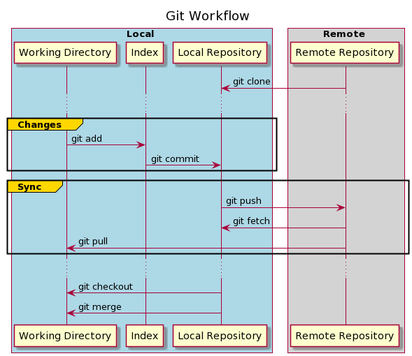

[< к содержанию](./readme.md)

## Рабочий процесс Git

После того, как  настроили наш локальный репозиторий, вы готовы применить первые изменения. Но прежде чем это сделаете, нужно проверить, как Git отслеживает эти изменения.

Наш локальный репозиторий состоит из трех разных деревьев, поддерживаемых Git.

Первый — рабочий каталог, в котором хранятся актуальные версии файлов.

После внесения изменений в файлы можно переместить файлы в индекс, который действует как промежуточная область. Мы делаем это с помощью команды ***git add***. Файлы в индексе начинают отслеживаться Git.

Наконец, мы можем применить и сохранить наши изменения в локальном репозитории с помощью команды git commit . Фиксация изменений обновляет HEAD репозитория, который всегда указывает на последнюю сделанную нами фиксацию.

Эти три шага используются для сохранения локальных изменений. Но, как известно, репозиторий может содержать и внешний источник. Последний шаг — синхронизировать оба репозитория и опубликовать наши изменения.
 

Теперь, когда мы знаем, как работает система отслеживания Git, мы готовы применить наши первые изменения в нашем репозитории.